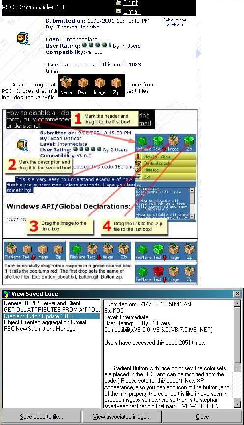



## PSC Downloader 2\.0

### Description

Have you ever wanted to have a place to put your code that you downloaded from PSC? Is tracking it all down and remembering what it is a problem?

Well, fret no more. With PSCdl2, you can keep track of all those nasty little bits of code in one spot. Building upon Thomas Hannibal's original code, I thought this is cool, but keeping track of all this is tough. I "lightened" it up a bit by removing some objects that cost heavy on the development side and redistribution.

Features include:

Drag-drop of all data including images and links to ZIP files.

Ability to retrieve ZIPs/Images/Abouts

Great for sites other than just PSC!

Features to come:

Edit entry titles

Edit descriptions

Delete entries

Upload from other sources!

Included:

Version 1 to version 2 utility (Read comments in Form1.frm under Quick Load)

Some sample code already uploaded.

This is a work in progress so PLEASE VOTE!!!

(Sorry commenting is so sparse... I'll fix that in a later release)
 
### More Info
 
You must register the enclosed DLL (Base64.dll). If that is not available you can get it from the website sevillaonline.com (It's free!).

See modComments.bas for more.

Uses the latest MDAC (2.6).

None, other than a sense of order... :)

Uses and Access 2000 database. After uploading much code to this file, it will grow considerably.

             |
---                |---
**Submitted On**   |2001-11-29 17:10:10
**By**             |[JohnB](https://github.com/Planet-Source-Code/PSCIndex/blob/master/ByAuthor/johnb.md)
**Level**          |Advanced
**User Rating**    |4.1 (29 globes from 7 users)
**Compatibility**  |VB 6\.0
**Category**       |[Complete Applications](https://github.com/Planet-Source-Code/PSCIndex/blob/master/ByCategory/complete-applications__1-27.md)
**World**          |[Visual Basic](https://github.com/Planet-Source-Code/PSCIndex/blob/master/ByWorld/visual-basic.md)
**Archive File**   |[PSC\_Downlo3841311292001\.zip](https://github.com/Planet-Source-Code/johnb-psc-downloader-2-0__1-29339/archive/master.zip)

### API Declarations

See code.

